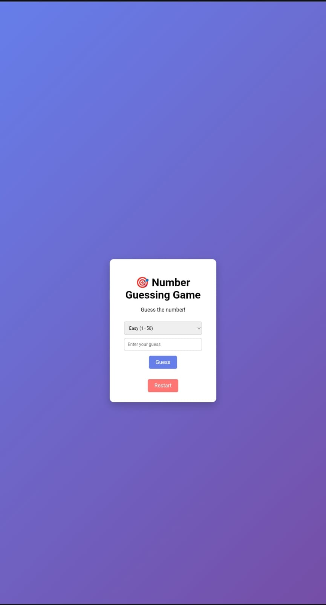

# 🎯 Number Guessing Game

A simple and interactive **Number Guessing Game** built using **HTML, CSS, and JavaScript**.  
The player has to guess a randomly generated number, and the game provides instant feedback until the correct number is guessed.

---

## 🚀 Live Demo
🔗 Play the game here:  
https://24a31a05bi.github.io/number-guessing-game/

---

## 📸 Screenshot

<p align="center">
  
</p>

---

## 🛠 Technologies Used
- **HTML** – Structure of the game  
- **CSS** – Styling and layout  
- **JavaScript** – Game logic and interactivity  

---

## 🎮 How to Play
1. Select a difficulty level  
2. Enter a number in the input box  
3. Click the **Guess** button  
4. The game will tell you whether your guess is **too high**, **too low**, or **correct**  
5. Keep guessing until you find the correct number  
6. Click **Restart** to play again  

---

## ✨ Features
- Random number generation  
- Multiple difficulty levels  
- User-friendly interface  
- Instant feedback on guesses  
- Restart option to replay the game  

---

## 📂 Project Structure
number-guessing-game/
├── index.html
├── style.css
├── script.js
├── screenshot.jpeg
└── README.md
---
## 🚀 How to Run Locally

1. Clone the repository:
   ```bash
   git clone https://github.com/24a31a05bi/number-guessing-game.git

----
🙌 Acknowledgement
This project was created as part of my learning journey in web development, focusing on improving JavaScript logic and UI design.
